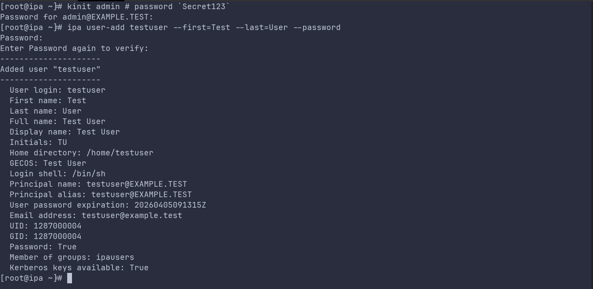
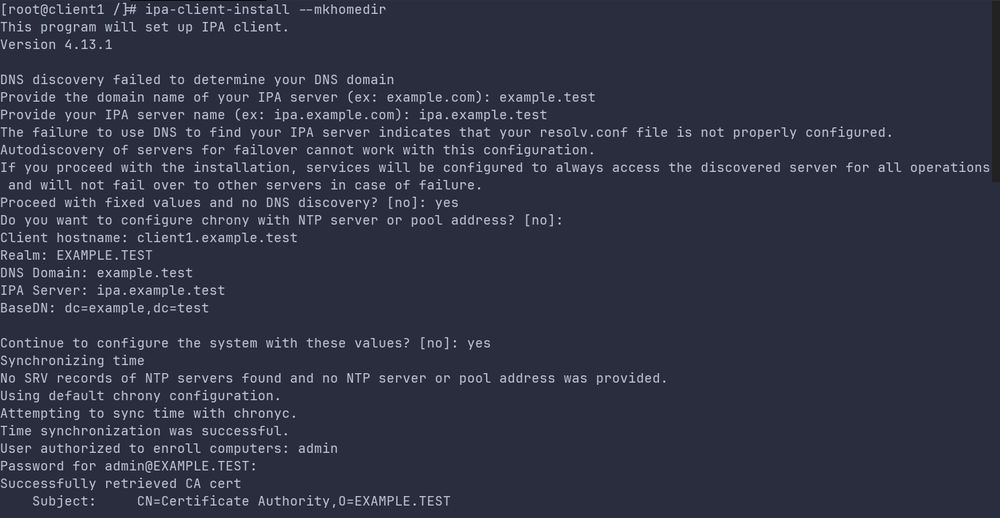
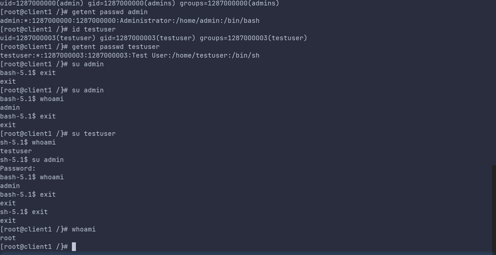

Domain Controller
=================

Introduction
------------

FreeIPA is a free, open-source Identity Management (IdM) solution designed primarily for Linux and Unix-based networked environments. Often described as the Linux equivalent of Microsoft Active Directory, it provides a centralized platform for managing authentication, authorization, and network policies.

Implementation
--------------

.. literalinclude:: ../../src/domain_controller/domain_controller.sh
   :language: bash

   
Usage
-----

Connect to domain controller instance with ssh.

Domain Controller
~~~~~~~~~~~~~~~~~

.. code-block:: bash
    
    # make sure the freeipa server is running completely
    docker exec -it linux-server-assignment-domain_controller-1 bash
    
    kinit admin # password `Secret123`
    ipa user-add testuser --first=Test --last=User --password

    
Client
~~~~~~

.. code-block:: bash

    # make sure to run this after the domain controller usage
    docker exec -it linux-server-assignment-centos9_systemd-1 bash

    dnf -y install freeipa-client
    echo "client1.example.test" > /etc/hostname
    hostname client1.example.test
    ipa-client-install --mkhomedir
    id admin
    getent passwd admin
    id testuser
    getent passwd testuser
    
    su admin
    su testuser

.. figure:: _static/domain_controller_3.png

