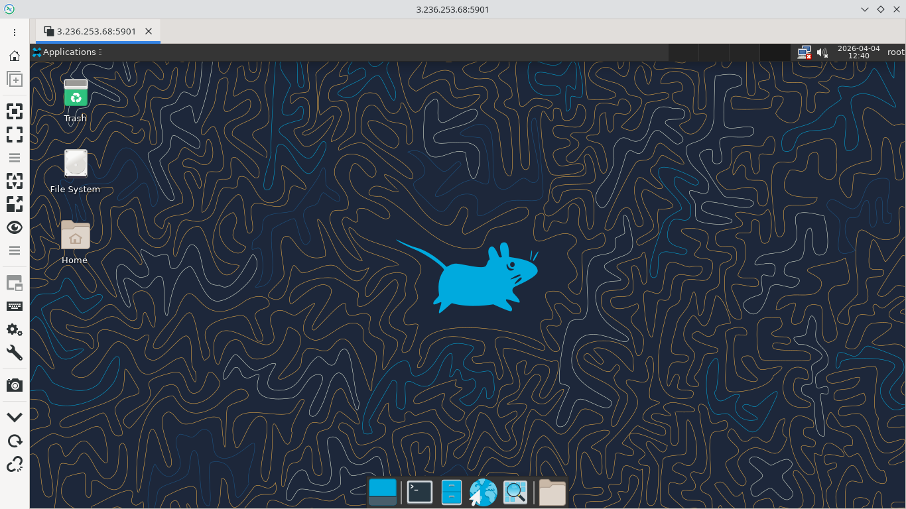

Terminal Server
===============

Introduction
------------

TigerVNC is a high-performance, platform-independent implementation of the Virtual Network Computing (VNC) protocol that allows users to remotely access and control graphical desktops on a server. A terminal server provides multiple users with simultaneous access to a centralized server environment, letting them run applications and desktops remotely while all processing happens on the server. Together, TigerVNC enables secure remote graphical sessions, effectively turning a terminal server into an accessible desktop environment for users from anywhere on the network.

Implementation
--------------

.. literalinclude:: ../../src/terminal_server/terminal_server.sh
   :language: bash

Usage
-----

Use vnc client such as remmina connecting to <ip_of_terminal_server>:5901 with password `dog@123`

